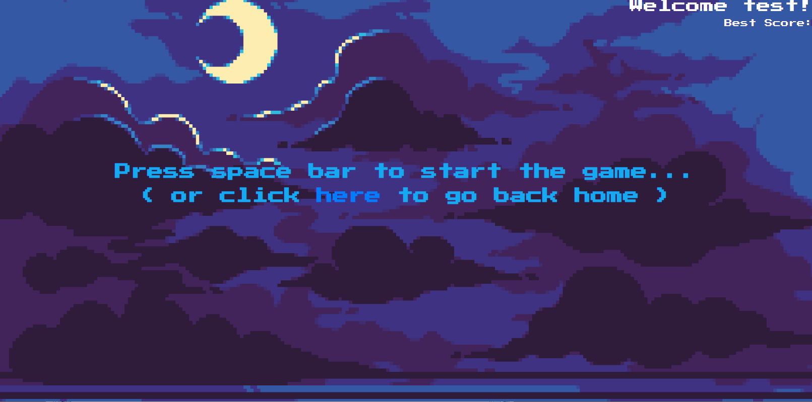

# Flappy-Birds
MERN Stack Flappy Bird browser game built with React and Passport/bCrypt for authentication security.

Deployed here: https://flappy-birds-deploy.herokuapp.com

## Technologies:
- HTML5
- CSS
- NodeJS
- ReactJS
- jQuery
- Express
- MongoDB
- Mongoose
- bCrypt
- PassportJS

Credits:
Myles Alcala - Project lead (database management, user authentication, game logic, integrations, repository management)
Tristan Martin - Front-End
Jason Cipollari - Front-End
